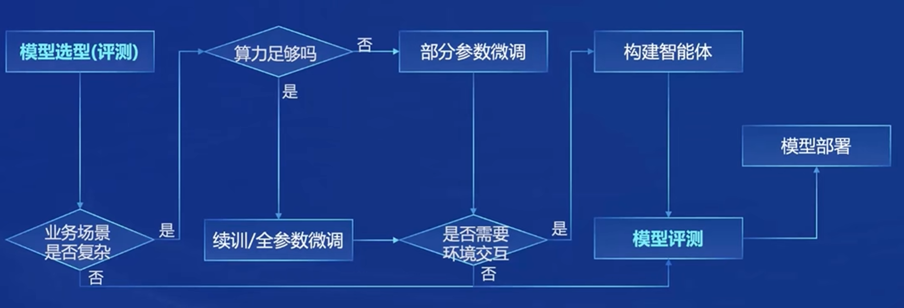

# 第一期 书生·浦语大模型全链路开源开放体系

## 1.学员个人情况  
   我是人工智能/机器人工程专业在读本科生，希望通过本次训练营了解大模型的基本原理，并上手实操体验应用搭建，并在这个过程中寻找兴趣点。  
        
## 2.课程笔记
### 2.1 行业趋势  
专用模型→通用大模型  
        
### 2.2 InternLM2体系  
    
#### 2.2.1 体量      
- 7B    
- 20B  
            
    
#### 2.2.2 模型版本
        
- InternLM2-Base  
		可塑性  

- InternLM2  
		搭建应用的优秀基座  

- InternLM2-Chat  
		指令遵循、共情聊天、调用工具能力  
                
### 2.3 主要亮点  
    
#### 2.3.1超长上下文
模型在 20万 token上下文中，几乎完美实现“大海捞针”  
            
    
#### 2.3.2综合性能
推理、数学、代码提升显著，InternLM2-Chat-20B 在重点评测上比肩ChatGPT  
            
    
#### 2.3.3优秀的对话和创作体验
精准指令跟随  
            
    
#### 2.3.4工具调用能力
支持工具多轮调用，复杂智能体搭建  
            
    
#### 2.3.5数理能力和数据分析功能
        
- 强大的内生计算能力  
            
        
- 加入`代码解释器`后，在`GSM8K` 和 `MATH` (数学数据集)达到和 GPT-4 相仿水平  
            
### 2.4 模型→应用的流程  

        
### 2.5 InternLM2全链条  
    
#### 2.5.1数据  
中文语料，来源OpenDataLab  
            
    
#### 2.5.2预训练  

    
#### 2.5.3微调  
        
- 微调框架XTuner  
            
        
- 增量续训  
            
	- 使用场景：让基座模型学习到一些新知识，如某个垂类领域知识  
                
            
	- 训练数据：文章、书籍、代码等  
                
        
- 有监督微调  
            
	- 使用场景：让模型学会理解各种指令进行对话，或者注入少量领域知识  
                
            
	- 训练数据：高质量的对话、问答数据  
                
    
#### 2.5.4部署  
LMDeploy  
            
    
#### 2.5.5评测  
OpenCompass 2.0 司南大模型评测体系  
- CompassRank 性能榜单  
                
	-  大语言模型评测  
	-  多模态模型评测  
                    
            
-  CompassKit 大模型评测工具  
                
            
- CompassKit 评测集社区  
                
    
#### 2.5.6应用  
        
- 智能体框架 Lagent  
            
        
- 多模态智能体工具箱 AgentLego  
            
## 3.课后感悟  
- 第一期课程就干货满满，帮我在大模型领域扫了盲
- 我整理了本期课程的主要内容，并标记了自己感兴趣/待了解的部分，希望能在接下来的实操课程中更具体地学习。
