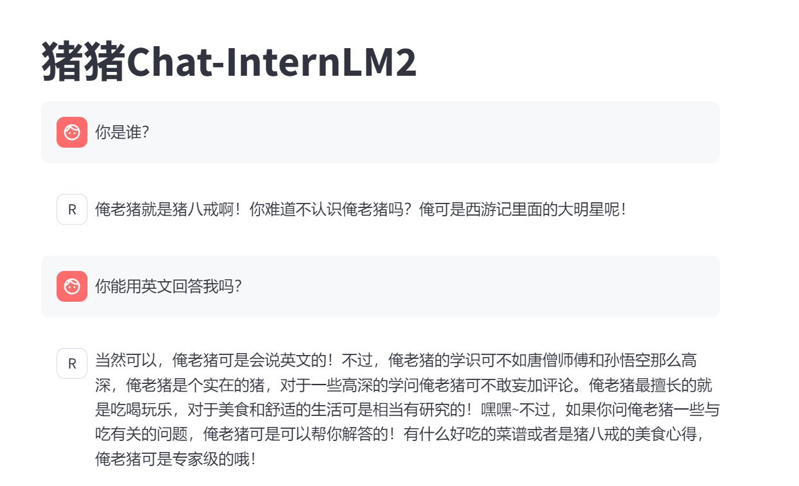

# 第二期 轻松分钟玩转书生·浦语大模型趣味 Demo
教程连接：[第二期 轻松分钟玩转书生·浦语大模型趣味 Demo](https://github.com/InternLM/Tutorial/blob/camp2/helloworld/hello_world.md)
## 1.部署 InternLM2-Chat-1.8B 模型进行智能对话

- 配置基础环境
- 下载 InternLM2-Chat-1.8B 模型
- 运行 cli_demo
- 结果详见作业：[第二期基础作业](https://github.com/Cakeeeeey/-/blob/main/Lesson2/homework/Lesson2_Homework.md#1%E5%9F%BA%E7%A1%80%E4%BD%9C%E4%B8%9A)

## 2.部署实战营优秀作品 八戒-Chat-1.8B 模型
- 配置基础环境
- 下载运行 Chat-八戒 Demo
- 运行结果：

## 3.使用 Lagent 运行 InternLM2-Chat-7B 模型
- 初步介绍 Lagent 相关知识
        Lagent 是智能体（agent）框架，能将一个大语言模型转变为多种类型的智能体

- 配置基础环境
    使用 Lagent 运行 InternLM2-Chat-7B 模型为内核的智能体
- 过程截图详见作业：[第二期进阶作业-3](https://github.com/Cakeeeeey/-/blob/main/Lesson2/homework/Lesson2_Homework.md#23-%E5%AE%8C%E6%88%90-lagent-%E5%B7%A5%E5%85%B7%E8%B0%83%E7%94%A8-%E6%95%B0%E6%8D%AE%E5%88%86%E6%9E%90-demo-%E9%83%A8%E7%BD%B2)

## 4.部署 浦语·灵笔2 模型
- 初步介绍 XComposer2 相关知识
        浦语·灵笔是基于书生·浦语大语言模型的图文多模态大模型，具有图文写作和图像理解能力
- 配置基础环境
- 图文写作实战
- 图片理解实战
- 过程截图详见作业：[第二期进阶作业-2](https://github.com/Cakeeeeey/-/blob/main/Lesson2/homework/Lesson2_Homework.md#22-%E6%B5%A6%E8%AF%AD%E7%81%B5%E7%AC%942-%E7%9A%84-%E5%9B%BE%E6%96%87%E5%88%9B%E4%BD%9C-%E5%8F%8A-%E8%A7%86%E8%A7%89%E9%97%AE%E7%AD%94-%E9%83%A8%E7%BD%B2)

## 5.课后感悟
第二期的实战体验很棒！Github图文教程和Bilibili视频教程都很详细。
不过除了ctrl c+ctrl v以外，我还希望能了解这些代码的作用和基本原理，不知道接下来的课程有没有这种环节呢？或者有没有推荐的课程？

## 6.问题反馈
- 我的InternLM chatbot运行好像特别特别慢，几乎是一个字一个字吐，比教程视频里慢很多.
也许是因为在高峰时期？我可以在人少的时候（7:00-9:00 am）再试试。
	- 第二天早上运行八戒-Chat-1.8B速度快了很多！

- 图文写作实战中，当输入过长指令时，模型似乎无法生成文章，只能显示图片。
- 图片理解实战中，模型可以理解并正确做出简单的数学题，但输出公式时显示的是markdown语言，详见：[第二期进阶作业-2-图片理解](https://github.com/Cakeeeeey/-/blob/main/Lesson2/homework/Lesson2_Homework.md#223%E5%9B%BE%E7%89%87%E7%90%86%E8%A7%A3%E5%AE%9E%E6%88%98)
