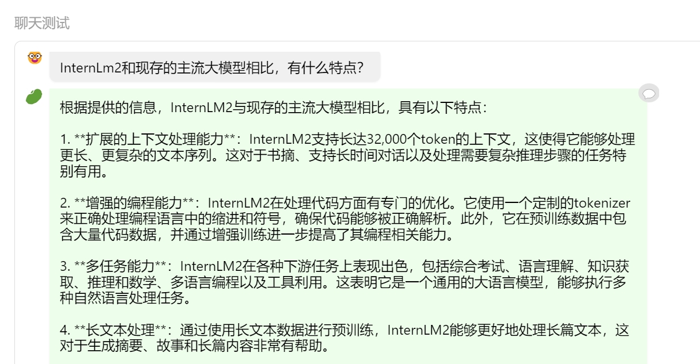

# 茴香豆：搭建你的RAG智能助理
## 1.基础作业 

### 1.1 在茴香豆 Web 版中创建自己领域的知识问答助手
#### 1.1.1 创建知识库

#### 1.1.2 上传文档

#### 1.1.3 线上茴香豆助手对话截图
对话：

闲聊：

### 1.2 在 InternLM Studio 上部署茴香豆技术助手（待编辑）
#### 1.2.1 环境配置
- 配置基础环境
- 下载基础文件
- 下载安装茴香豆
#### 1.2.2 使用茴香豆搭建 RAG 助手
- 修改配置文件
- 创建知识库
- 运行茴香豆知识助手
#### 2.2.3 针对问题"茴香豆怎么部署到微信群？"进行提问

## 2.进阶作业（算法方向）
### 2.1RAG常见优化方法

#### 2.1.1提高数据库质量
- **嵌入优化**
结合稀疏和密集检索、多任务
- **索引优化**
细粒度分割、元数据

#### 2.1.2优化用户问题
- **查询优化**
查询扩展、转换、多查询
- **上下文管理**
重排、上下文选择/压缩，减少冗余信息

#### 2.1.3优化检索过程
- **迭代检索**
根据用户问题与已生成内容，重复检索
- **递归检索**
迭代细化搜索查询、链式推理指导检索过程
- **自适应检索**
Flare、Slef-RAG，让LLM自己决定搜索的内容和时机

