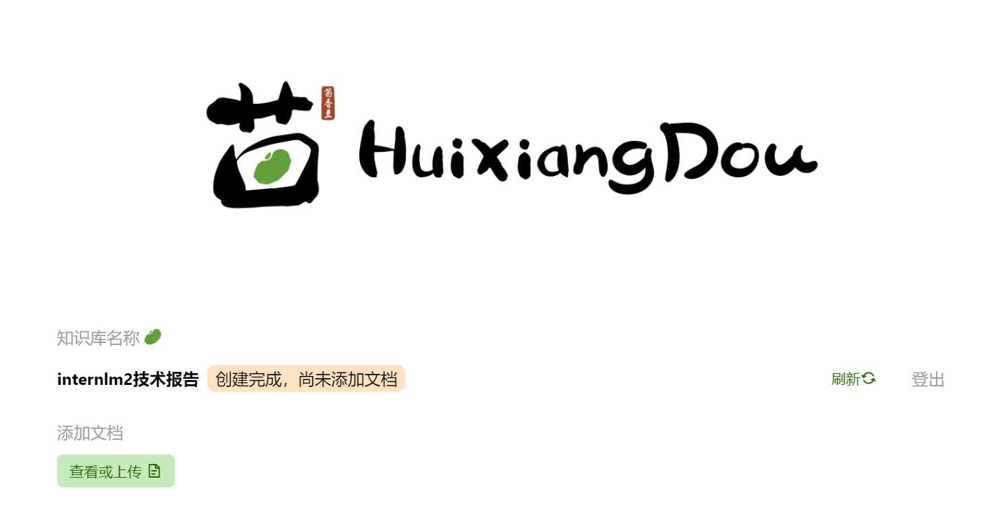
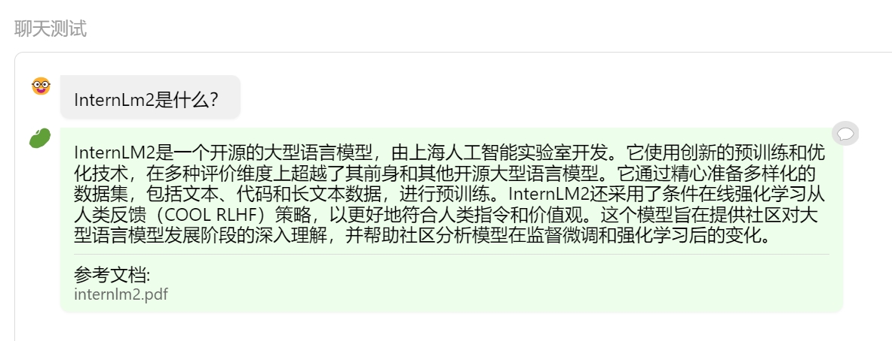
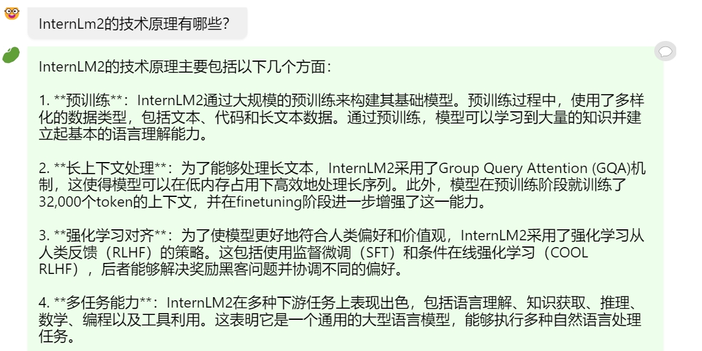

# 茴香豆：搭建你的RAG智能助理
## 1.理论部分
### 1.1.RAG概述
RAG使LLM在训练数据库没有相关信息情况下，实现新增知识的问答。

#### 1.1.2原理
- **Indexing 索引**
将外部知识(如文档或网页)编码成向量，存储在向量数据库中

- **Retriving 检索**
将用户的问题编码成向量，并在向量数据库中找到与之最相关的文档块(top-k chunks)

- **Generation 生成**
将检索到的文档块与用户的问题一起作为提示(prompt )输入到大模型(LLM)中，生成回答

#### 1.1.3RAG常见优化方法

##### 1.1.3.1提高数据库质量
- **嵌入优化**
结合稀疏和密集检索、多任务
- **索引优化**
细粒度分割、元数据

##### 1.1.3.2优化用户问题
- **查询优化**
查询扩展、转换、多查询
- **上下文管理**
重排、上下文选择/压缩，减少冗余信息

##### 1.1.3.3优化检索过程
- **迭代检索**
根据用户问题与已生成内容，重复检索
- **递归检索**
迭代细化搜索查询、链式推理指导检索过程
- **自适应检索**
Flare、Slef-RAG，让LLM自己决定搜索的内容和时机

### 1.2茴香豆介绍
基于LLMs的领域知识助手，主要用于在群聊中识别出问题并解答

## 2.实践部分
### 2.1 在茴香豆 Web 版中创建自己领域的知识问答助手
#### 2.1.1 创建知识库

#### 2.1.2 上传文档

#### 2.1.3 线上茴香豆助手对话截图
对话：

闲聊：

### 2.2 在 InternLM Studio 上部署茴香豆技术助手（待编辑）
#### 2.2.1 环境配置
配置基础环境
下载基础文件
下载安装茴香豆
#### 2.2.2 使用茴香豆搭建 RAG 助手
修改配置文件
创建知识库
运行茴香豆知识助手
#### 2.2.3 针对问题"茴香豆怎么部署到微信群？"进行提问
