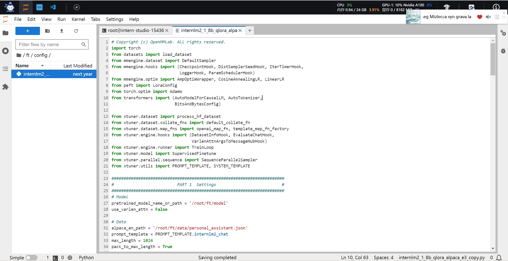

# 1. 基础作业
-   训练自己的小助手认知
开发机准备

环境安装

数据集准备

模型准备

配置文件选择

配置文件修改
**配置文件介绍**
1.  **PART 1 Settings**：涵盖了模型基本设置，如预训练模型的选择、数据集信息和训练过程中的一些基本参数（如批大小、学习率等）。
    
2.  **PART 2 Model & Tokenizer**：指定了用于训练的模型和分词器的具体类型及其配置，包括预训练模型的路径和是否启用特定功能（如可变长度注意力），这是模型训练的核心组成部分。
    
3.  **PART 3 Dataset & Dataloader**：描述了数据处理的细节，包括如何加载数据集、预处理步骤、批处理大小等，确保了模型能够接收到正确格式和质量的数据。
    
4.  **PART 4 Scheduler & Optimizer**：配置了优化过程中的关键参数，如学习率调度策略和优化器的选择，这些是影响模型训练效果和速度的重要因素。
    
5.  **PART 5 Runtime**：定义了训练过程中的额外设置，如日志记录、模型保存策略和自定义钩子等，以支持训练流程的监控、调试和结果的保存。

一般来说需要更改的部分其实只包括前三部分，而且修改的主要原因是我们修改了配置文件中规定的模型、数据集
后两部分都是 XTuner 官方优化好的东西，一般而言只有在魔改的情况下才需要进行修改

使用 deepspeed 来加速训练

模型转换
模型转换的本质其实就是将原本使用 Pytorch 训练出来的模型权重文件转换为目前通用的 Huggingface 格式文件

模型整合
LoRA 或者 QLoRA 微调出来的模型其实并不是一个完整的模型，而是一个额外的层（adapter）。那么训练完的这个层最终还是要与原模型进行组合才能被正常的使用。

对话测试

# 2. 进阶作业（待编辑）

-   将自我认知的模型上传到 OpenXLab，并将应用部署到 OpenXLab（优秀学员必做）
-   复现多模态微调（优秀学员必做）

OpenXLab 部署教程：[https://github.com/InternLM/Tutorial/tree/camp2/tools/openxlab-deploy](https://github.com/InternLM/Tutorial/tree/camp2/tools/openxlab-deploy)
