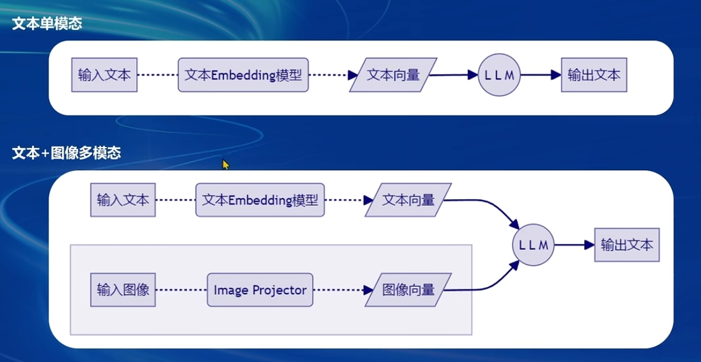

# 1.Finetune简介
## 1.1 两种Finetune范式
- **微调的目的**
使基座模型更好地应对下游任务，更好地应用于某个特定领域
- **增量预训练微调**
使用场景:让基座模型学习到一些新知识，如某个垂类领域的常识
训练数据:文章、书籍、代码等
- **指令跟随微调**
使用场景:让模型学会对话模板，根据人类指令进行对话
训练数据:高质量的对话、问答数据

## 1.2 一条数据的一生

## 1.3 微调方案LoRA、QLoRA
LLM 的参数量主要集中在模型中的 Linear，训练这些参数会耗费大量的显存
LORA 通过在原本的 Linear 旁，新增一个支路，包含两个连续的小 Linear新增的这个支路通常叫做 Adapter
Adapter 参数量远小于原本的 Linear，能大幅降低训练的显存消耗
# 2. XTuner微调框架
特点：训练速度快，显存占用低
两个优化技巧：
- Flash Attention
Flash Attention 将 Attention 计算并行化，避免了计算过程中Attention Score NxN的显存占用(训练过程中的 N 都比较大)
- DeepSpeed ZeRO
ZeRO 优化，通过将训练过程中的参数、梯度和优化器状态切片保存，能够在多 GPU 训练时显著节省显存
除了将训练中间状态切片外，DeepSpeed 训练时使用 FP16 的权重，相较于 Pytorch 的 AMP 训练在单 GPU 上也能大幅节省显存
# 3. 多模态LLM

## 3.1 多模态原理：LLaVA
对图像数据生成描述，以此构建出大量<question text><image>--<answer text>的数据对
利用这些数据对，配合文本单模态 LLM，训练出一个Image Projector，使LLM能够处理图片
Image Projector 的训练和测试，有点类似LoRA 微调方案，二者都是在已有LLM的基础上，用新的数据训练一个新的小文件
